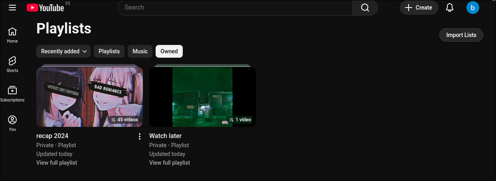
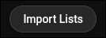

<p align="center">
  
</p>

[](https://creativecommons.org/licenses/by/4.0/)


# YT-PLAYLIST-ENHANCED 🎵

**YT-PLAYLIST-ENHANCED** (formerly **YT-LISTS-MANAGER**) is a **Google Chrome extension** designed to supercharge your YouTube playlist management. Easily export, import, and organize videos, starting from the bottom of your playlists. Perfect for creators, curators, and power users who want full control over their YouTube content.

---

<p align="center">
  
</p>

**YT-PLAYLIST-ENHANCED** enhances your YouTube playlist experience. Easily view, reverse, import, and export playlists in JSON format.

---

## 🚀 Features

- **Reverse Playlists** – Instantly reverse the order of any playlist.
  <p align="center">
    
  </p>
  <p align="center">
    
  </p>

- **Import Playlists** – Load playlists from JSON files to restore or duplicate them.  
  <p align="center">
    
  </p>
  <p align="center">
    
  </p>

- **Export Playlist Button** – Save playlists to JSON files for backup or sharing.  
  <p align="center">
    
  </p>
- **Reversed Button** – Quickly invert the playlist order.
  <p align="center">
    
  </p> 
- **Import Button** – Easily import playlists from JSON files.  
  <p align="center">
    
  </p> 

---

## 🛠️ Installation

1. Clone or download this repository:  
   ```bash
   git clone https://github.com/Boris027/YT-PLAYLIST-ENHANCED

2. Open **Chrome** and navigate to `chrome://extensions/`.
3. Enable **Developer Mode**.
4. Click **Load unpacked** and select the extension folder.
5. The extension icon will appear in your toolbar.

---

## 🎮 Usage

1. Click the **YT-PLAYLIST-ENHANCED** icon in your browser toolbar (You will see the instructions).
2. Select a playlist to view its contents.
3. Click **Reverse Playlist** to invert the order.
4. Use **Export** to save playlists as JSON files.
5. Use **Import** to load playlists from JSON files (This should be from the general playlist page).

---

## 📄 JSON Format Example

```json
[
  {
    "index": "1",
    "title": "Ava Max - Sweet But Psycho (Traducida al Español)",
    "thumbnail": "https://img.youtube.com/vi/dZbjNgEWbfo/mqdefault.jpg",
    "duration": "3:15",
    "url": "https://www.youtube.com/watch?v=dZbjNgEWbfo&list=LRSRi7RBwAs1pCKXNKxaEa0hTi8elFiyLGryZ&index=1&pp=gAQBiAQB8AUB"
  },
  {
    "index": "2",
    "title": "Nightcore- On my way (epic version) Alan Walker",
    "thumbnail": "https://img.youtube.com/vi/XuS7u9nQmfU/mqdefault.jpg",
    "duration": "2:10",
    "url": "https://www.youtube.com/watch?v=XuS7u9nQmfU&list=LRSRi7RBwAs1pCKXNKxaEa0hTi8elFiyLGryZ&index=2&pp=gAQBiAQB8AUB"
  }
]
